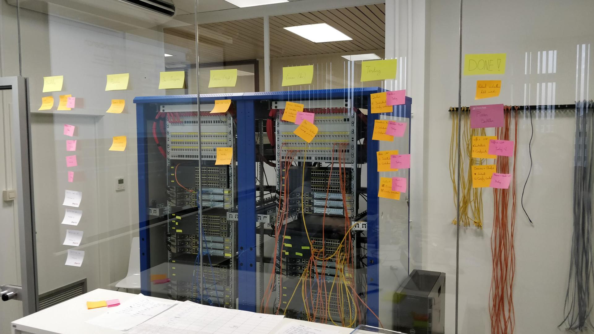
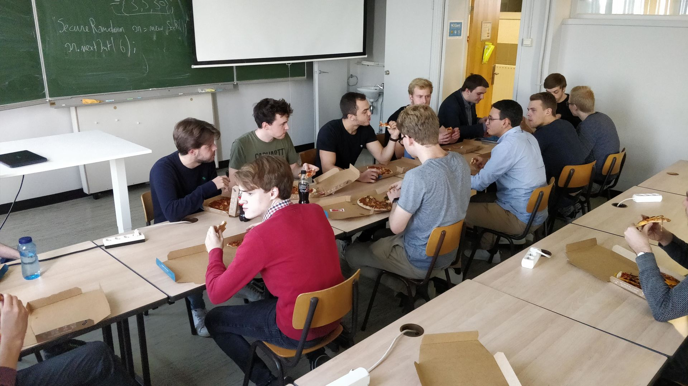

@snap[west text-22 text-bold]
Linux curriculum at HOGENT
@snapend

@snap[south-west byline text-06]
Bert Van Vreckem, LOADays, 2019-05-04
@snapend

---

## Introduction

+++

### whoami

- Bert Van Vreckem
- Lecturer ICT at University College Ghent (HOGENT)
    - Linux, stats, project/thesis coach
- Open source enthousiast
    - Linux user since ~2000
    - Ansible, Git, LaTeX, Vagrant, ...

+++

### Contents

- overview courses & content
- assignments, projects and team work
- open source/open content teaching tools and materials
- request for feedback

+++

### Request for feedback

What skills/knowledge do you expect from a junior Linux system engineer/administrator?

---

## Bachelor IT programme at HOGENT

"Professionele bachelor toegepaste informatica"

Professional bachelor applied computer science

+++

### Bachelor IT programme at HOGENT

- 3 year degree
- 5 semesters of 12 weeks
- 1 semester internship

+++

### Our philosophy

T-shaped IT professional

- sysadmin should have dev skills
- Linux, Windows Server and Cisco CCNA

+++

### Structure

- **Year 1:** Common curriculum
- **Year 2:** Specialisation
    - Software Development
    - Network and System Administration
- **Year 3:** Additional specialisations
    - E-business
    - Mainframe Development and Administration

---

## Linux in the curriculum

+++

## Linux curriculum overview

- Year 1, sem 2: Workshop Linux
- Year 2, sem 1: Introduction to Linux
- Year 2, sem 2: System engineering project
- Year 3, sem 1:
    - Enterprise Linux
    - System engineering project

---

## Linux Workshop

+++

### Year 1, sem 2: Workshop Linux

- Single, 2 hour workshop
- Based on free Cisco Netacad Linux Unhatched course

<https://www.netacad.com/courses/os-it/ndg-linux-unhatched>

+++

---

## Introduction to Linux

+++

### Year 2, sem 1: Introduction to Linux

- Part of course "Operating Systems"
- 12 weekly two hour sessions
- ~20 minutes instruction + guided exercises
- For all students (also dev)

+++

### Topics

- Installation (Fedora Workstation on VirtualBox)
- Command line basics
- Filesystem hierarchy
- Working with text
- Users and permissions
- Installing a LAMP stack
- Shell scripts

+++

### Course material

- Paul Cobbaut, Linux Fundamentals, <http://linux-training.be/linuxfun.pdf>
- Lecture slide decks: <https://github.com/HoGentTIN/ilnx-slides/>
- Lab assignments: <https://github.com/HoGentTIN/ilnx-labos>
- Screencasts published on Youtube: <https://www.youtube.com/playlist?list=PLVNAsM9wXC__nAV5I97lJeg53mhwvStfT>

+++

### Assessment

Written exam with preparation on prepared VM

- VM
    - Fedora, text console
    - All software, man pages installed
    - Vim, Nano, ...
- Short, open/closed questions
- Scripting assignment

---

## System engineering project

+++

### Year 2, semester 2: System engineering project

- Teams of 4 students
- Several smaller, independent assignments
    - Linux/Windows Server/Cisco
- Project management:
    - Applying agile methodologies, kanban
    - Visualising WIP
    - Time estimates & Timesheet

+++

### Assignments

(for this academic year)

- Network equipment lab assignments
    - Physical Cisco router/switching labs
- Automate web application server setup
    - LAMP, WISA
    - Vagrant + VirtualBox
    - Deploy on IaaS platform (AWS, DigitalOcean, Azure)

+++

+++

+++

- SME ict infrastructure analysis and design for external customer
- Microsoft Deployment Tookit proof-of-concept
- Backup server proof-of-concept for external customer

+++

### Linux specific tasks

- Vagrant + VirtualBox
- PoC LAMP stack with web application (e.g. Wordpress, Drupal)
- Shell provisioning
- Script should be reusable on cloud platform

+++

### Course material

- Initial team repository on Github: <https://github.com/HoGentTIN/p2ops-sjabloon>

+++

### Assessment

- Rubrics (see <https://en.wikipedia.org/wiki/Rubric_(academic)>)
- Product + process
- Team members must prove their individual contribution!

---

## Enterprise Linux

+++

### Year 3, sem 1: Enterprise Linux

- 12 three hour sessions
- Some lectures/demos, mainly lab assignments
- Focus:
    - Configuration Management (Ansible)
    - CentOS 7 as base platform
    - Bottom-up troubleshooting

+++

### Assignments

- Main assignment: choice between
    - SME infrastructure
    - High Availability
    - Continuous Integration
- Secondary assignment: current topics
    - Apply new technique/tool/... from blog/conf presentation/...
    - Contribute to an open source project related to the course
- Troubleshooting labs

+++

+++

+++

### Assignment current topics

Examples:

- Apply Ansible Vault
- Apply tips for hardening Linux to the main assignment
- Contribute to the development of Ansible roles used for the main assignment or project
- ...

+++

### Troubleshooting labs

- Students get prepared VM with configuration errors
- E.g. LAMP, DNS server, DHCP, LAN

+++

### Course material

- Course syllabus: <https://github.com/hogenttin/elnx-syllabus>
    - Including lecture slides and demo environment
- Assignments:
    - SME: <https://github.com/hogenttin/elnx-sme>
        - includes acceptance tests in BATS
    - HA: <https://github.com/hogenttin/elnx-ha>
    - CI: <https://github.com/hogenttin/elnx-cd>

+++

### Course material

- "Handbook" = RedHat manuals
    - <https://access.redhat.com/documentation/en-us/red_hat_enterprise_linux/7/>
    - System Administrator's Guide
    - Networking Guide
    - SELinux User's and Administrator's Guide

+++

### Assessment

- Based on Rubrics
    - Pass means *competent*, not *can answer half of the questions*
- Complete lab assignments
- Successfully complete troubleshooting assignment
- Documentation, cheat sheet, lab reports

---

## System engineering project

+++

### Year 3, sem 1: System engineering project

- Large teams, one big assignment
- 12 weekly sessions (3 hrs)
- Focus on:
    - Larger scale, larger team
    - Automation and reproducability
    - Integration of network services
- Challenging!

+++

+++

### Planning

- W1-6: standup + teamwork
- W7: whole day rehearsal production release
- W8: retrospective
- W8-11: remediation & improvements
- W12: 4 hours, final production release

Students must work individually between sessions!

+++

+++

+++

+++

+++

### Assignment

- Build "large" ict infrastructure
    - network equipment + services
- Must be fully automated
    - Configuration Management
    - PowerShell
- Students can choose
    - Linux, Windows, Cisco

+++

### Alternative: devops project

- 2 students system administration join team of application developers
- support for all things ops
    - db setup
    - production infra (cloud)
    - test infra (e.g. Vagrant)
    - CI/CD pipeline

---

## Request for feedback (revisited)

+++

### What did you like?

+++

### What did you miss?

+++

### Suggestions for improvement?

---

## Thank you!

<https://twitter.com/bertvanvreckem>

<https://github.com/hogenttin>